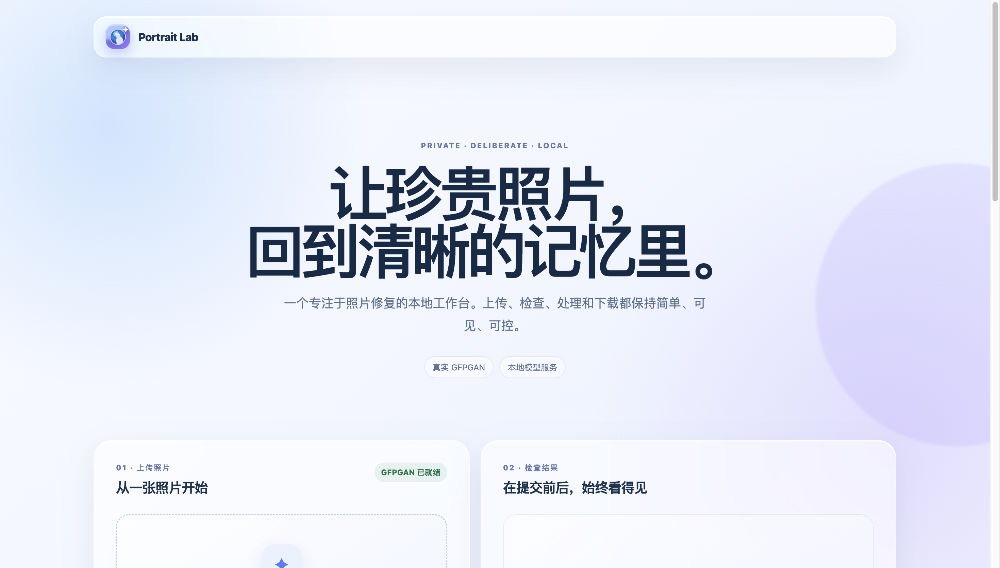
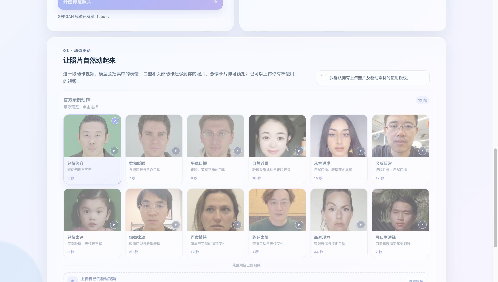

# Portrait Lab

<p align="center">
  A local-first macOS workspace for portrait restoration and consent-based portrait animation.
</p>

Portrait Lab pairs a Vue 3 interface with a small Flask API. Image restoration
uses GFPGAN in an isolated Python environment; optional portrait animation uses
the official LivePortrait runtime in a separate environment. Photos, results,
model weights, and driving videos remain on the Mac that runs the service.

## Interface

<p align="center">
  
</p>

<p align="center">
  <em>Local-first restoration workspace — no browser chrome, account information, or personal uploads are shown.</em>
</p>

<p align="center">
  
</p>

<p align="center">
  <em>Consent-based motion selection with the credited upstream sample library.</em>
</p>

## What it does

- Restore JPG, PNG, and WebP images with a 1×–4× GFPGAN workflow.
- Compare the selected image and result in one workspace and download the
  generated file locally.
- Generate a short animated portrait from an authorized driving clip using
  LivePortrait.
- Browse local LivePortrait sample clips as named preview cards, or provide an
  authorized MP4, MOV, or WebM clip for a single job.
- Run the model API only on `127.0.0.1`; uploads and generated media are not
  sent to a hosted service by this project.

## Architecture

```text
Vue 3 + Vite (localhost:5173)
          │
          ├── GFPGAN restoration API ── isolated Python 3.10 environment
          │
          └── LivePortrait animation ── separate Python 3.10 environment + FFmpeg
```

## macOS quick start

### Prerequisites

- macOS on Apple Silicon or Intel
- [Homebrew](https://brew.sh/)
- Node.js 20 or newer

Install the two system tools used by the setup scripts:

```bash
brew install uv ffmpeg
```

### 1. Clone and prepare GFPGAN

```bash
git clone https://github.com/rick-a11/portrait-lab.git
cd portrait-lab
./scripts/bootstrap-gfpgan-macos.sh
```

Download the official `GFPGANv1.4.pth` weight into `models/`, as described in
[docs/MODELS.md](docs/MODELS.md). Model files are deliberately ignored by Git.

### 2. Prepare optional animation support

```bash
./scripts/bootstrap-liveportrait-macos.sh
```

This step is optional if you only need still-image restoration. It downloads
the official LivePortrait source, its required local weights, and its sample
driving clips into ignored local directories.

### 3. Start the local services and UI

In the first Terminal window:

```bash
./scripts/portrait-lab-service.zsh start
```

In a second Terminal window:

```bash
cd frontend
npm ci
npm run dev
```

Open the local address printed by Vite, normally
[`http://127.0.0.1:5173`](http://127.0.0.1:5173). Confirm API health with:

```bash
curl --fail http://127.0.0.1:5000/api/health
```

If port 5000 is busy, the service safely selects 5001–5003 and records the
actual port in `.runtime/portrait-lab-api.port`. The frontend automatically
checks the same port range.

## Reusable local controls

Run these commands from the repository root whenever you need them:

```bash
./scripts/portrait-lab-service.zsh start
./scripts/portrait-lab-service.zsh status
./scripts/portrait-lab-service.zsh stop
```

The launcher only stops a process it can identify as Portrait Lab; it does not
take over another application that happens to use a local port.

Finder users can instead double-click `Start Portrait Lab.command`, `Check
Portrait Lab Status.command`, `Stop Portrait Lab.command`, or `Open Driving
Clips.command` in the repository root.

## Privacy and responsible use

- This repository contains no model weights, generated results, uploaded
  photos, driving videos, account data, deployment identifiers, API tokens, or
  machine-specific paths.
- Use only images and driving material that you own or are authorized to use.
- The custom driving-video upload is handled as a single local job and is
  removed by the API after the model process completes.
- Review the licenses and acceptable-use terms of every upstream dependency
  before commercial or production deployment.

## Credits

Portrait Lab is grateful to the upstream projects that make the local workflow
possible:

- [TencentARC/GFPGAN](https://github.com/TencentARC/GFPGAN) for face
  restoration research and model releases.
- [KwaiVGI/LivePortrait](https://github.com/KwaiVGI/LivePortrait) for portrait
  animation, setup guidance, and the optional sample driving clips.

Neither upstream source code, model weights, nor sample media is vendored here.
Their licenses and notices continue to apply to their respective materials.

## Development checks

```bash
# Backend routes, upload validation, CORS, and animation job behavior
.venv-gfpgan/bin/python -m unittest backend.tests.test_api -v

# Frontend unit tests, type checking, and production build
cd frontend && npm test
```

## License

The original Portrait Lab source code in this repository is released under the
[MIT License](LICENSE). Upstream projects and all model or media downloads keep
their own licenses and usage restrictions.
